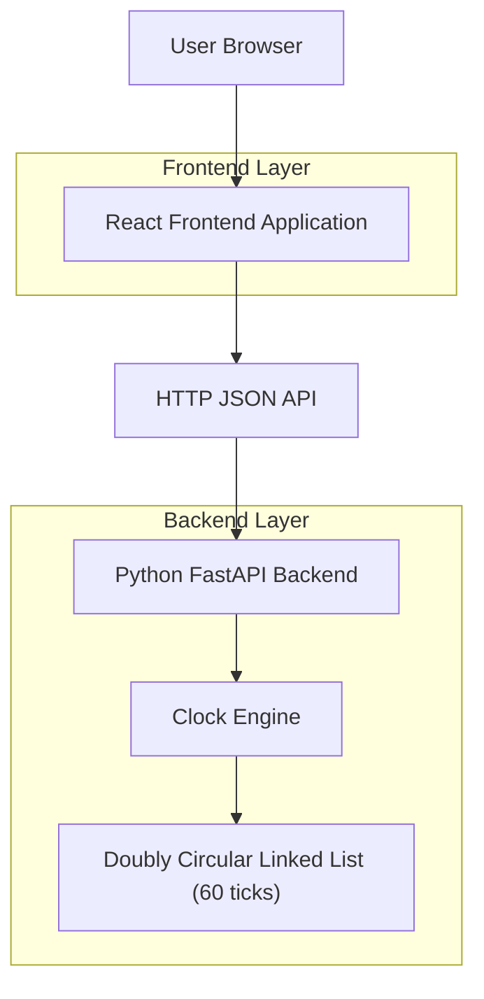
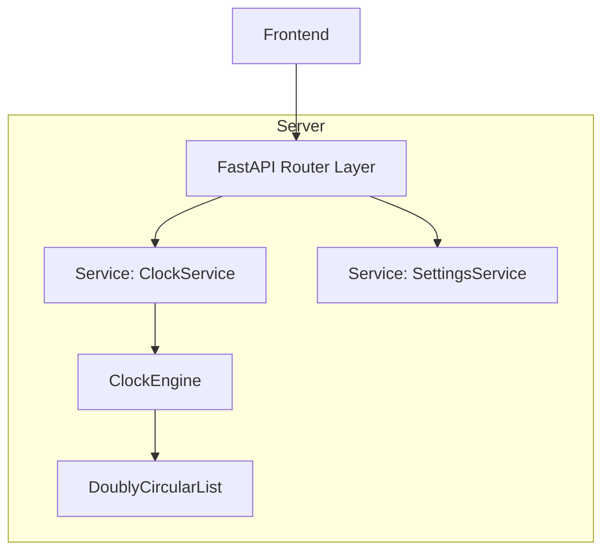

## 1.Architecture design


## 2.Technology Description
- Frontend: React@18 + TypeScript + vite + (opcional) tailwindcss
- Backend: Python@3.11 + FastAPI + Uvicorn
- Database: None (settings en memoria; opcional persistir en archivo JSON)

## 3.Route definitions
| Route | Purpose |
|-------|---------|
| / | Página de Reloj (Inicio), render del reloj y controles |
| /settings | Ajustes de apariencia y movimiento |
| /about | Explicación del enfoque y guía de ejecución |

## 4.API definitions (If it includes backend services)

### 4.1 Core API

Get clock render state
```
GET /api/clock/state
```
Response (TypeScript types compartibles):
```ts
export type ClockHandAngles = {
  hourDeg: number;
  minuteDeg: number;
  secondDeg: number;
};

export type Tick = {
  index: number;      // 0..59
  deg: number;        // angle for tick mark
  isHourMark: boolean;
};

export type ClockState = {
  isoTime: string;            // e.g. 2026-04-27T12:34:56.000Z
  mode: "realtime" | "simulated";
  running: boolean;
  angles: ClockHandAngles;
  ticks: Tick[];              // 60 items
};
```

Update settings
```
POST /api/settings
```
Request:
| Param Name | Param Type | isRequired | Description |
|-----------|------------|------------|-------------|
| theme | "light" \| "dark" | true | UI theme |
| size | number | true | Clock pixel size |
| smoothMotion | boolean | true | Smooth vs tick motion |
| refreshHz | number | true | Render/update rate |
| timeZone | string | false | IANA tz or "local" |
| simulationSpeed | number | false | e.g. 1, 2, 10 |

Response:
| Param Name | Param Type | Description |
|-----------|------------|-------------|
| ok | boolean | Update result |

## 5.Server architecture diagram (If it includes backend services)


## 6.Data model(if applicable)
No se requiere base de datos para un MVP.
- Settings: estructura en memoria (y opcionalmente serializada a JSON).
- El estado del reloj se deriva del time source + engine, sin persistencia.
