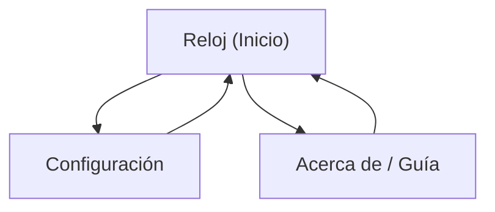

## 1. Product Overview

Aplicación de reloj analógico con frontend, cuyo “motor” de cálculo usa una lista circular doble como estructura central.
Sirve para visualizar la hora en un dial analógico y demostrar el uso práctico de estructuras de datos en Python.

## 2. Core Features

### 2.1 Feature Module

El producto se compone de estas páginas principales:

1. **Reloj (Inicio)**: visualización del reloj analógico, control de ejecución (iniciar/pausar), modo (tiempo real o simulado).
2. **Configuración**: ajustes del reloj (tema, tamaño, suavizado de movimiento, zona horaria/modo simulación).
3. **Acerca de / Guía**: explicación del enfoque con lista circular doble, cómo correr el proyecto y decisiones técnicas.

### 2.2 Page Details

| Page Name        | Module Name                         | Feature description                                                                                                        |
| ---------------- | ----------------------------------- | -------------------------------------------------------------------------------------------------------------------------- |
| Reloj (Inicio)   | Analog Clock Canvas/SVG             | Renderizar dial, marcas (60), números (12) y manecillas (hora/min/seg) con actualización periódica.                        |
| Reloj (Inicio)   | Clock Engine (Double Circular List) | Calcular posiciones angulares de marcas y manecillas recorriendo una lista circular doble (60 nodos) y mapeando a ángulos. |
| Reloj (Inicio)   | Controls                            | Iniciar/pausar; alternar “Tiempo real” vs “Simulación”; resetear simulación.                                               |
| Reloj (Inicio)   | Status Bar                          | Mostrar hora digital (HH:MM:SS) y estado (running/paused, modo).                                                           |
| Configuración    | Appearance                          | Cambiar tema (claro/oscuro), tamaño del reloj, grosor/colores de manecillas.                                               |
| Configuración    | Motion                              | Ajustar modo de movimiento (tick por segundo vs suave) y frecuencia de refresco.                                           |
| Configuración    | Time Source                         | Seleccionar zona horaria o usar local; en simulación ajustar velocidad (x1, x2, x10) y hora inicial.                       |
| Configuración    | Persistence                         | Guardar/cargar ajustes (mínimo: en memoria; opcional: archivo local del backend).                                          |
| Acerca de / Guía | Concepto Estructura Central         | Explicar cómo la lista circular doble representa los 60 “ticks” y cómo se navega en ambos sentidos.                        |
| Acerca de / Guía | How to Run                          | Instrucciones para levantar backend Python y frontend; variables principales.                                              |
| Acerca de / Guía | Prompts por Partes                  | Lista de prompts sugeridos para generar el proyecto por etapas (código en inglés).                                         |
| Acerca de / Guía | Estructura de Carpetas              | Mostrar árbol de carpetas propuesto para backend/frontend y módulos clave.                                                 |

## 3. Core Process

**Flujo principal (Usuario):**

1. Entras a **Reloj (Inicio)** y ves el reloj analógico corriendo en tiempo real.
2. (Opcional) Pausas y activas **Simulación** para avanzar el tiempo a distinta velocidad.
3. Vas a **Configuración**, ajustas tema/tamaño/movimiento y vuelves al reloj para ver reflejados los cambios.
4. Abres **Acerca de / Guía** para entender la lista circular doble, la estructura del proyecto y cómo ejecutarlo.



***

## Anexos

### A) Estructura de carpetas (propuesta)

> Nota: nombres en inglés para mantener el código en inglés.

```
/ (repo)
  /backend
    /app
      __init__.py
      main.py                 # FastAPI entrypoint
      /clock
        __init__.py
        doubly_circular_list.py  # Core data structure
        clock_engine.py          # Uses list to compute angles
        time_source.py           # Real time vs simulated
      /api
        __init__.py
        routes_clock.py          # /api/clock/*
        routes_settings.py       # /api/settings/*
      /models
        __init__.py
        settings.py              # Pydantic models
    requirements.txt
    README.md

  /frontend
    /src
      /components
        AnalogClock.tsx
        ClockControls.tsx
        SettingsForm.tsx
      /pages
        ClockPage.tsx
        SettingsPage.tsx
        AboutPage.tsx
      /lib
        apiClient.ts
        geometry.ts
      main.tsx
      router.tsx
      styles.css
    package.json
    vite.config.ts
    README.md

  README.md
```

### B) Prompts por partes (para generar el proyecto)

> Objetivo: prompts listos para usar con un asistente de IA. Pide explícitamente **“Code in English.”**

> Restricciones clave: **Everything in Python (backend + frontend), no digital clock UI, must use a doubly circular linked list as the central 60-tick model, add persistence, include extra data structures and patterns.**

1. **Prompt 1 — Scope, modules, folder structure**

* “Design a minimal analog clock web app that is 100% Python (backend + frontend). Use a doubly circular linked list as the core structure representing 60 ticks. Propose a clean folder structure, module responsibilities, and public APIs. No digital clock. Code in English.”

2. **Prompt 2 — Core data structure: doubly circular linked list**

* “Implement a doubly circular linked list in Python: Node(value), next, prev; DoublyCircularLinkedList with size, head, current pointer, insert_after_current, remove_current, move_forward(n), move_backward(n), and to_list(limit). Add type hints and docstrings. Code in English.”

3. **Prompt 3 — Additional data structures package**

* “Create a small Python package with extra data structures usable by the app: DynamicArray wrapper, Stack (LIFO), Queue (FIFO), SinglyLinkedList, DoublyLinkedList. Provide consistent interfaces, type hints, docstrings, and small usage examples. Code in English.”

4. **Prompt 4 — Design patterns applied**

* “Apply the following design patterns to the analog clock app in Python (with clear class boundaries): Factory Method (time source creation: RealTime vs Simulated), Facade (ClockService facade for UI), Decorator (rendering layers or settings transformations), Proxy (persistence/caching proxy), Adapter or Bridge (bridge UI rendering and engine). Provide a short explanation of where each pattern is used and implement it. Code in English.”

5. **Prompt 5 — Clock engine (angles) powered by the circular list**

* “Build a ClockEngine in Python that uses the doubly circular list of 60 nodes to compute angles for second/minute/hour hands and tick marks (including major ticks). Return a JSON-friendly ClockState payload. Include both real-time and simulated time sources. No digital clock display. Code in English.”

6. **Prompt 6 — Persistence feature (SQLite)**

* “Add a persistent feature using SQLite: store user settings (theme colors, tick style, simulation speed, time offset) and a persistent list of saved presets. Implement a repository layer and a service layer; do not store secrets. Provide migrations/initialization, and ensure settings persist across restarts. Code in English.”

7. **Prompt 7 — Frontend in Python (web UI)**

* “Implement the frontend fully in Python (no React). Use a Python web UI framework that can render SVG and supports periodic updates. Create 3 pages: Clock, Settings, About. Render an analog clock (SVG preferred) driven by ClockState. Add interactions: toggle real/simulated, adjust speed, apply preset, undo last setting change. No digital clock UI. Code in English.”

8. **Prompt 8 — Undo/redo + event history using Stack/Queue**

* “Implement undo/redo for settings using Stack; implement an event history stream using Queue. Wire these into the UI (e.g., Undo button and a small event log). Keep the UI non-digital (no numeric time readout). Code in English.”

9. **Prompt 9 — Tests, typing, run instructions**

* “Add pytest tests for the doubly circular list traversal, engine angle outputs, and persistence repository. Add basic static typing configuration, and provide a README with run instructions for Windows. Code in English.”
